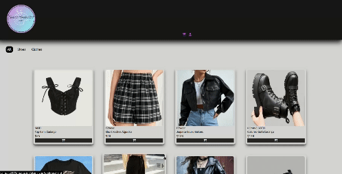
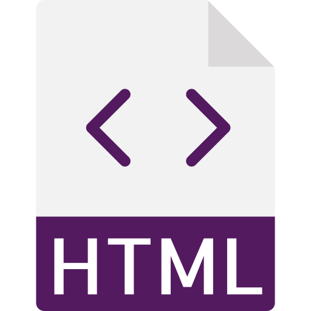
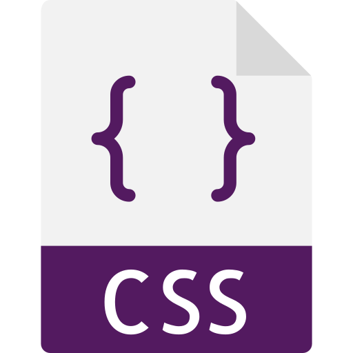
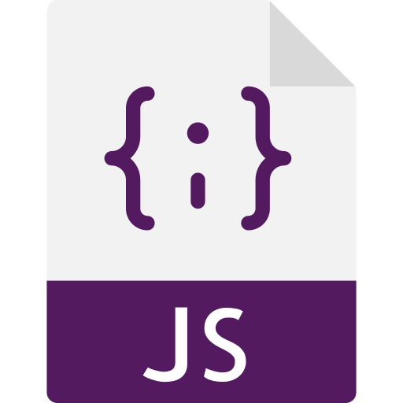

<h1>Nimsay WebStore-site</h1>  
  
This is an e-commerce

  
  
You can check the page, and see it working <a href="https://yasminconstantino.github.io/WebStore-Site/">here</a>

  <h4> Languages and Technologies:</h4>
  

    
    
    
  

 
<h5>...</h5>
 
<section>
  

    
Clique aqui para ler em português

    
Esse é um e-commerce

    
Você pode acessar a página e ver ela funcionando <a href="https://yasminconstantino.github.io/WebStore-Site/">aqui</a>

    <h4>Linguagens e tecnologias utilizadas:</h4>
    

        
        
        
    

  

</section>
